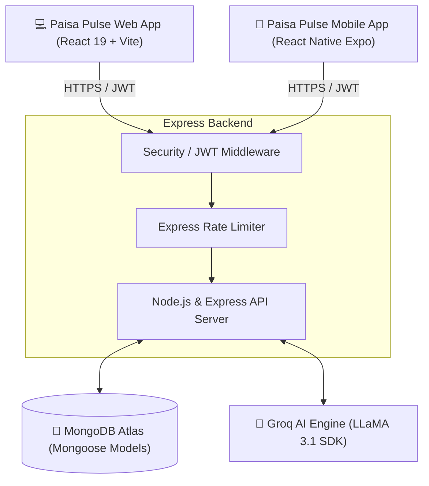

# 💰 Paisa Pulse: Smart AI-Powered Finance Suite

> A unified multi-platform financial ecosystem featuring an AI-driven personal expense tracker, investment tracker, budgeting engine, and secure multi-role dashboard.

[](https://react.dev/)
[](https://reactnative.dev/)
[](https://expo.dev/)
[](https://nodejs.org/)
[](https://www.mongodb.com/)
[](https://groq.com/)
[](LICENSE)

---

## 🗺️ System Architecture

This suite consists of a central **Node.js/Express API Server** connected to **MongoDB Atlas** for data persistence and **Groq Cloud (LLaMA 3.1)** for intelligent analysis. It is consumed by both a web dashboard and a mobile app (**Paisa Pulse**).



---

## ✨ Features & Capabilities

### 🔒 1. Secure Authentication & Multi-Role Workflows
*   **JWT-Based Security:** Password hashing using `bcryptjs` and session tokens verified with JWT.
*   **Role-Based Workflows:** Users have specified roles (`Organizer`, `Approver`, `FinanceAdmin`) for the Event Finance modules:
    *   **Organizer:** Submits budget requests and drafts expenses.
    *   **Approver:** Audits submitted expenses and approves/rejects them.
    *   **FinanceAdmin:** Processes approved expenses, marks them as paid, and administers database-wide overrides.

### 🤖 2. Groq AI Integration (LLaMA 3.1)
*   **Smart Categorization:** Automatic classification of transactions based on natural language input (e.g. typing *"Spent 500 on dinner"* automatically logs as an expense under category *"Food & Dining"*).
*   **AI Financial Advisor:** Context-aware interactive chatbot that reads a complete snapshot of the user's financial profile (incomes, budgets, expenses, active loans, goal progress, and upcoming bills) to generate tailored savings strategies.

### 💰 3. Personal Financial Tools
*   **Income & Expense Tracking:** Log and filter your daily cash flow.
*   **Budget Planner:** Create category-wise monthly budgets with color-coded warning rings when close to the limit.
*   **Investment Portfolio:** Track stocks, mutual funds, gold, and other asset holdings, showing real-time growth, principal investment, and returns.
*   **Debt & Loan Tracker:** Manage active loans (taken/lent) with amortization status, interest calculations, and monthly EMI tracker.
*   **Goal Board:** Target-driven saving plans with progress indicators.
*   **Recurring Bills:** Manage upcoming utilities and subscription payments with automated status checks.

### 👥 4. Collaborative Features
*   **Family Hub:** Link multiple user accounts to share a single domestic budget pool, tracking domestic helper payroll, groceries, and shared services.

---

## 📂 Directory Structure

The repository is modularly split into client, server, and mobile directories:

```
ai-finance-tracker/
├── client/                     # 💻 Paisa Pulse Web Application (React 19)
│   ├── src/
│   │   ├── components/         # Interactive elements (Navbar, StatCards, ChatBot, Pagination)
│   │   ├── context/            # AuthContext provider
│   │   ├── pages/              # Primary route components (Dashboard, Profile, Bills, Family, Loans...)
│   │   ├── services/           # Axios-based API service calls (api.js, authService.js, etc.)
│   │   ├── styles/             # Global CSS files (Tailwind configuration dependencies)
│   │   ├── utils/              # Helper utilities (helpers.js)
│   │   └── App.jsx             # React Router config & route nesting
│   ├── package.json
│   └── tailwind.config.js
│
├── server/                     # ⚙️ Node.js / Express Backend API Server
│   ├── src/
│   │   ├── config/             # DB and client configuration (db.js)
│   │   ├── controllers/        # Express route handler logic (aiController.js, authController.js, etc.)
│   │   ├── middleware/         # Auth verification, rate limiting, and error-handling
│   │   ├── models/             # Mongoose schemas (User, Event, Expense, Income, Loan, Investment...)
│   │   ├── routes/             # API routing configurations mapping paths to controllers
│   │   └── index.js            # Express application setup, security config, and listener
│   ├── .env                    # Configuration file (environment variables)
│   └── package.json
│
└── mobile/                     # 📱 Paisa Pulse Mobile App (React Native + Expo)
    ├── src/
    │   ├── components/         # Reusable UI widgets
    │   ├── context/            # Local auth providers (AuthContext.js)
    │   ├── navigation/         # Native Navigation controllers (AppNavigator.jsx)
    │   ├── screens/            # Application views (DashboardScreen, BudgetPlannerScreen, GoalsScreen...)
    │   ├── services/           # Service connectors using Axios (api.js)
    │   └── utils/              # Shared helper functions
    ├── App.jsx                 # App entry point with safe-area and navigation setup
    ├── app.json                # Expo config (bundle IDs, assets)
    └── package.json
```

---

## 🏃 Local Setup & Installation

Follow these instructions to run the application components locally.

### 📋 Prerequisites
*   [Node.js](https://nodejs.org/) (v18 or newer recommended)
*   [MongoDB Atlas](https://www.mongodb.com/cloud/atlas) account (or local MongoDB community server)
*   [Groq API Key](https://console.groq.com/) for LLaMA 3.1 integration
*   For mobile testing: [Expo Go](https://expo.dev/client) app installed on your smartphone (Android/iOS)

---

### 1. Backend Server Setup

Navigate into the `server` folder:
```bash
cd server
```

Install packages:
```bash
npm install
```

Create a `.env` configuration file inside the `server/` directory and populate it with the following:
```env
PORT=5000
NODE_ENV=development
MONGO_URI=your_mongodb_connection_string
JWT_SECRET=your_jwt_secret_phrase
JWT_EXPIRE=7d
GROQ_API_KEY=your_groq_api_key
CLIENT_URL=http://localhost:5173
```

Start the backend:
```bash
npm run dev
```
The server will boot on `http://localhost:5000` with hot-reloading active.

---

### 2. Frontend Web Setup

Navigate into the `client` folder:
```bash
cd ../client
```

Install packages:
```bash
npm install
```

Start the Vite development server:
```bash
npm run dev
```
The web dashboard will open automatically or be accessible at `http://localhost:5173`.

---

### 3. Mobile App Setup

Navigate into the `mobile` folder:
```bash
cd ../mobile
```

Install packages:
```bash
npm install
```

Start the Expo bundler:
```bash
npx expo start
```
*   **Android:** Press `a` in your terminal or scan the QR code on screen using the Expo Go App.
*   **iOS:** Scan the QR code using the system Camera app.
*   **Note:** Make sure your mobile device and computer are on the same Wi-Fi network. By default, API calls are directed to the live server. To target your local server, update the `baseURL` within `mobile/src/services/api.js` to point to your computer's local IP address (e.g. `http://192.168.x.x:5000/api`).

---

## 🌐 API Route Endpoint Specifications

The backend exposes the following modular routes:

| Service / Domain | Route Prefix | Primary Purpose |
| :--- | :--- | :--- |
| **Auth** | `/api/auth` | User register, login, profile management, and credentials validation |
| **Events** | `/api/events` | Create, list, edit events; track dedicated event budget limits |
| **Expenses** | `/api/expenses` | Log cash outflows, link to events, change approval/payout status |
| **Income** | `/api/income` | Track salary, gig earnings, and miscellaneous gains |
| **Budgets** | `/api/budgets` | Set up monthly category-wise ceilings |
| **AI Integration** | `/api/ai` | Access natural language chat agent and auto-category predictions |
| **Investments** | `/api/investments` | Monitor portfolio balances, asset prices, and performance yields |
| **Loans & Debts** | `/api/loans` | Administer money borrowed or lent, computing interest and EMIs |
| **Goals** | `/api/goals` | Form savings initiatives and allocate balances |
| **Bills** | `/api/bills` | Control monthly utilities and track outstanding bills |
| **Health** | `/api/health` | Public diagnostics endpoint confirming server status |

---

## 🚀 Deployment & Production Guidelines

### Server API
Deploy the Node.js/Express server to platforms like **Render**, **Railway**, or **Heroku**.
*   Configure environment variables on the hosting platform.
*   Ensure that the `CLIENT_URL` points to your deployed web domain.

### React Frontend Web
Deploy the built client bundle from Vite to **Vercel** or **Netlify**.
*   Add a `vercel.json` rewrite file to support single-page application (SPA) client routing:
    ```json
    {
      "rewrites": [{ "source": "/(.*)", "destination": "/index.html" }]
    }
    ```
*   Set `VITE_API_URL` to point to your deployed backend URL.

### Expo Mobile App
Use EAS (Expo Application Services) to build binaries for distribution:
*   Configure project options in `eas.json` and `app.json`.
*   Log in via `npx eas login`.
*   Build for Android: `eas build -p android`
*   Build for iOS: `eas build -p ios`

---

## 👥 Authors & License

*   **Lead Developer:** Sudharsan V — [GitHub Profile](https://github.com/Sudharsanv06)
*   **License:** Distributed under the MIT License. See [LICENSE](./mobile/LICENSE) file in the `mobile` subfolder for details.